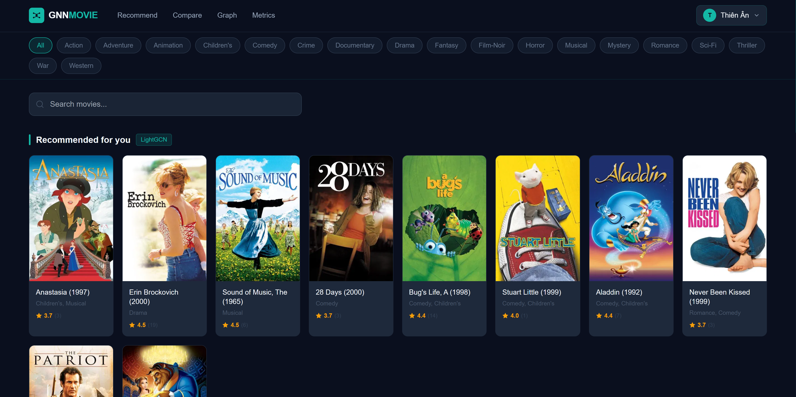
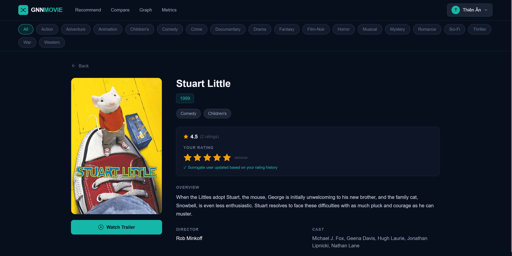
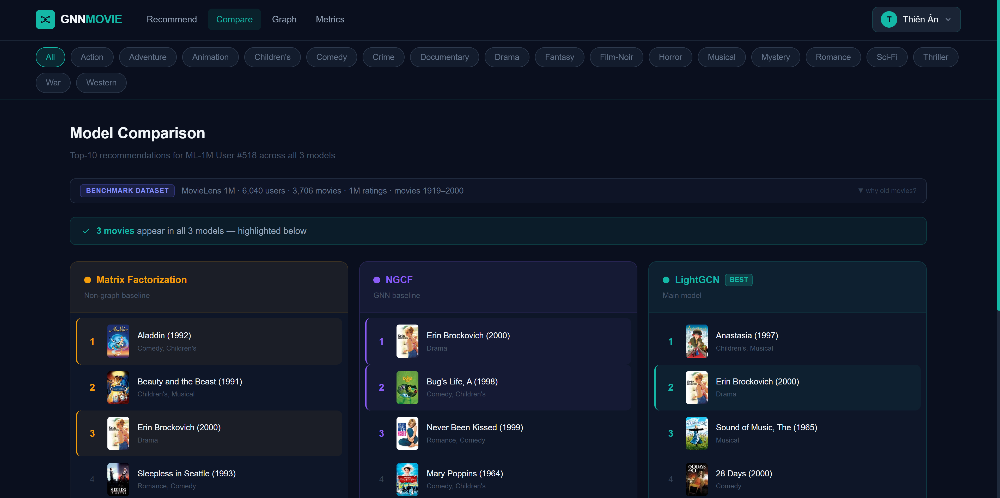

# GNN-Based Movie Recommendation System

Bachelor thesis project: controlled empirical comparison of Matrix Factorization, NGCF, and LightGCN on MovieLens 1M, integrated with a full-stack web application featuring a Neo4j knowledge graph and a cold-start surrogate mapping strategy.

---
## Screenshots

### Homepage


### Movie Detail Page


### Model Comparison


## Table of Contents

- [Architecture Overview](#architecture-overview)
- [Tech Stack](#tech-stack)
- [Prerequisites](#prerequisites)
- [Project Structure](#project-structure)
- [Setup Guide](#setup-guide)
  - [1. Python Environment](#1-python-environment)
  - [2. MySQL Database](#2-mysql-database)
  - [3. Neo4j Graph Database](#3-neo4j-graph-database)
  - [4. Frontend](#4-frontend)
- [Reproducing Experiments](#reproducing-experiments)
- [Running the Full System](#running-the-full-system)
- [Experiment Results](#experiment-results)

---

## Architecture Overview

```
┌─────────────────────────────────────────────────────────────┐
│                      Browser (React)                         │
│              frontend/ — Vite + Tailwind CSS                 │
└──────────────────────────┬──────────────────────────────────┘
                           │ HTTP (port 5173 → 8000)
┌──────────────────────────▼──────────────────────────────────┐
│                  FastAPI Backend                              │
│              gnn_service/ — Python 3.12                      │
│   • Loads MF / NGCF / LightGCN checkpoints (.pt)            │
│   • Serves personalised recommendations                      │
│   • Cold-start surrogate mapping                             │
└──────┬────────────────────────────────────┬─────────────────┘
       │                                    │
┌──────▼──────────┐                ┌────────▼────────────────┐
│   MySQL         │                │   Neo4j                  │
│  gnn_movie DB   │                │  Knowledge Graph         │
│  • web users    │                │  • user–movie graph      │
│  • ratings      │                │  • subgraph queries      │
│  • movie meta   │                │  • visualisation         │
└─────────────────┘                └─────────────────────────┘

┌─────────────────────────────────────────────────────────────┐
│                 GNN Training Pipeline                         │
│               gnn_training/ — PyTorch                        │
│   train.py → checkpoints/*.pt → gnn_service reads them      │
└─────────────────────────────────────────────────────────────┘
```

**Key design decision:** Neo4j is used exclusively for graph visualisation and interpretability queries. It does **not** participate in model training. The learned embeddings come purely from BPR-optimised collaborative filtering on the user–item interaction graph.

---

## Tech Stack

| Layer | Technology |
|---|---|
| Model training | Python 3.12, PyTorch, PyTorch Geometric |
| Backend API | FastAPI, Uvicorn |
| Graph DB | Neo4j (visualisation only) |
| Relational DB | MySQL 8 |
| Frontend | React 19, Vite 8, Tailwind CSS, Axios |
| Dataset | MovieLens 1M (auto-downloaded) |
| Movie metadata | TMDB API (posters, trailers) |

---

## Prerequisites

| Requirement | Version | Notes |
|---|---|---|
| Python | 3.10 – 3.12 | 3.12 recommended |
| Node.js | 18+ | for frontend |
| MySQL | 8.0+ | running locally |
| Neo4j | 5.x | Community Edition is sufficient |
| CUDA (optional) | 11.8+ | CPU works but training is slow |
| TMDB API key | — | free at themoviedb.org |

---

## Project Structure

```
gnn_thesis/
│
├── database/
│   └── gnn_movie.dump          # MySQL dump (2 MB) — restore with one command
│
├── gnn_training/               # Model training & analysis
│   ├── train.py                # Main training script (MF, NGCF, LightGCN)
│   ├── eda.py                  # Dataset EDA — generates eda_overview.png
│   ├── model_analysis.py       # Post-training analysis (no retraining)
│   ├── patience_analysis.py    # Early-stopping sensitivity experiment
│   ├── baseline_comparison.py  # Popularity baseline vs GNN models
│   ├── qualitative_analysis.py # Qualitative cases: 4 user types
│   ├── coldstart_eval.py       # Cold-start surrogate mapping evaluation
│   ├── neo4j_import.py         # Import trained embeddings into Neo4j
│   ├── fetch_movies.py         # Fetch TMDB metadata into MySQL
│   ├── fetch_trailers.py       # Fetch trailer URLs into MySQL
│   ├── seed_fake_data.py       # Seed demo users and ratings into MySQL
│   │
│   ├── checkpoints/            # Saved model weights (auto-created)
│   │   ├── mf_model.pt
│   │   ├── ngcf_model.pt
│   │   └── lightgcn_model.pt
│   │
│   ├── data/ml-1m/             # Dataset (auto-downloaded by train.py)
│   │   ├── ratings.dat
│   │   ├── movies.dat
│   │   └── users.dat
│   │
│   └── results/                # All generated charts and JSON files
│       ├── eda_overview.png
│       ├── loss_curves.png
│       ├── metrics_comparison.png
│       ├── model_complexity.png
│       ├── convergence_epochs.png
│       ├── patience_sensitivity.png
│       ├── baseline_comparison.png
│       ├── qualitative_cases.png
│       ├── coldstart_eval.png
│       └── results.json
│
├── gnn_service/                # FastAPI recommendation backend
│   ├── src/
│   │   ├── main.py             # API routes (recommend, compare, graph, users)
│   │   ├── model.py            # Model registry — loads checkpoints at startup
│   │   ├── recommend.py        # Scoring and ranking logic
│   │   ├── neo4j_client.py     # Neo4j query functions
│   │   ├── mysql_client.py     # MySQL query functions
│   │   └── schemas.py          # Pydantic response schemas
│   ├── requirements.txt
│   └── .env.example
│
└── frontend/                   # React web application
    ├── src/
    │   ├── pages/              # Home, Recommend, Compare, Graph,
    │   │                       # Metrics, Profile, MovieDetail,
    │   │                       # Login, Register, Onboarding
    │   ├── components/         # Navbar, graph, metrics components
    │   ├── context/            # AuthContext (JWT auth state)
    │   └── api/index.js        # Centralised Axios API client
    ├── package.json
    └── vite.config.js
```

---

## Setup Guide

### 1. Python Environment

```bash
# From project root
python -m venv gnn_env

# Windows
gnn_env\Scripts\activate

# macOS / Linux
source gnn_env/bin/activate

pip install torch torchvision torchaudio --index-url https://download.pytorch.org/whl/cu118
pip install torch-geometric
pip install fastapi uvicorn[standard] neo4j mysql-connector-python \
            python-dotenv pandas numpy matplotlib
```

> **CPU-only install:** Replace the `--index-url` line with `pip install torch torchvision torchaudio`

---

### 2. MySQL Database

Configure credentials first:

```bash
cp gnn_service/.env.example gnn_service/.env
cp gnn_training/.env.example gnn_training/.env
# Edit both .env files: DB_PASSWORD, NEO4J_PASSWORD, TMDB_ACCESS_TOKEN
```

**Option A — Restore from dump (recommended, no TMDB key needed):**

```bash
mysql -u root -p -e "CREATE DATABASE IF NOT EXISTS gnn_movie CHARACTER SET utf8mb4 COLLATE utf8mb4_unicode_ci;"
mysql -u root -p gnn_movie < database/gnn_movie.dump
```

The dump includes all 3,706 movie records (titles, genres, posters, trailers) and 200 seeded demo users.

**Option B — Fetch fresh from TMDB (requires `TMDB_ACCESS_TOKEN` in `.env`):**

```bash
mysql -u root -p -e "CREATE DATABASE IF NOT EXISTS gnn_movie CHARACTER SET utf8mb4 COLLATE utf8mb4_unicode_ci;"
python gnn_training/fetch_movies.py    # ~1-2 hours (rate limited)
python gnn_training/fetch_trailers.py  # ~30 minutes
python gnn_training/seed_fake_data.py  # seed 200 demo users
```

---

### 3. Neo4j Graph Database

1. Install [Neo4j Community Edition](https://neo4j.com/download/) and start the server
2. Set your password in both `.env` files
3. After training the models, import the interaction graph:

```bash
python gnn_training/neo4j_import.py
```

---

### 4. Frontend

```bash
cd frontend
npm install
```

Verify the API base URL in [frontend/src/api/index.js](frontend/src/api/index.js) — default is `http://localhost:8000`.

---

## Reproducing Experiments

All scripts auto-download the MovieLens 1M dataset on first run. Run everything from the **project root**.

### Step 1 — Dataset EDA

```bash
python gnn_training/eda.py
```

Output: `gnn_training/results/eda_overview.png`

---

### Step 2 — Train all three models

```bash
python gnn_training/train.py
```

- Downloads MovieLens 1M automatically if not present
- Trains Matrix Factorization → NGCF → LightGCN with BPR loss + early stopping
- Saves best checkpoints to `gnn_training/checkpoints/`
- Saves `results/loss_curves.png` and `results/results.json`

**Hyperparameters (fixed for all models):**

| Parameter | Value |
|---|---|
| Embedding dim | 64 |
| Batch size | 2048 |
| Learning rate | 1e-3 |
| L2 regularisation | 1e-4 |
| Early stopping patience | 10 (eval every 5 epochs) |
| Max epochs | 300 |
| GNN layers | 3 |
| Random seed | 42 |
| Train / Val / Test split | 80 / 10 / 10 per user |

> **Skip retraining:** If checkpoints already exist, `train.py` skips training and only evaluates. Delete a `.pt` file to force retraining that model.

---

### Step 3 — Post-training analysis (no retraining)

```bash
python gnn_training/model_analysis.py
```

Output:
- `metrics_comparison.png` — Precision@10, Recall@10, NDCG@10 bar chart
- `model_complexity.png` — parameter count vs performance scatter
- `convergence_epochs.png` — epoch at convergence per model

---

### Step 4 — Early stopping sensitivity

```bash
python gnn_training/patience_analysis.py
```

Trains all 3 models at patience ∈ {3, 5, 10, 20}. Output: `patience_sensitivity.png`.

> This reruns training — it will take time.

---

### Step 5 — Baseline comparison

```bash
python gnn_training/baseline_comparison.py
```

Adds a non-personalised Popularity baseline and compares against all models.
Output: `baseline_comparison.png`, `baseline_results.json`

---

### Step 6 — Qualitative analysis

```bash
python gnn_training/qualitative_analysis.py
```

Selects 4 representative user types (heavy, light, genre-focused, mixed) and compares genre-level recommendation quality across models.
Output: `qualitative_cases.png` + console listing of recommended movie titles.

---

### Step 7 — Cold-start evaluation

```bash
python gnn_training/coldstart_eval.py
```

Simulates 500 new users with no history. Evaluates four strategies:
- **Random** — random movie selection
- **Popularity** — globally most-rated movies
- **Genre Surrogate** — most genre-similar existing user → LightGCN recs
- **Rating Surrogate** — Jaccard similarity on 5 seed items → LightGCN recs

Output: `coldstart_eval.png`, `coldstart_results.json`

---

### Full reproduction order

```
train.py → model_analysis.py → eda.py
         → baseline_comparison.py
         → qualitative_analysis.py
         → coldstart_eval.py
         → patience_analysis.py   (optional, slow)
```

Steps 3–7 only load checkpoints — safe to run in any order after Step 2.

---

## Running the Full System

Open three terminals simultaneously:

**Terminal 1 — Backend API**
```bash
source gnn_env/Scripts/activate   # Windows: gnn_env\Scripts\activate
cd gnn_service
uvicorn src.main:app --reload --port 8000
```

**Terminal 2 — Frontend**
```bash
cd frontend
npm run dev
# Runs at http://localhost:5173
```

**Terminal 3 — Neo4j** (if not running as a service)
```bash
# Start Neo4j server — see your Neo4j installation docs
```

---

## Experiment Results

| Model | Precision@10 | Recall@10 | NDCG@10 | Convergence Epoch |
|---|---|---|---|---|
| Popularity (baseline) | 0.0624 | 0.0813 | 0.0853 | — |
| Matrix Factorization | 0.1102 | 0.1694 | 0.1684 | 55 |
| NGCF | 0.1102 | 0.1653 | 0.1678 | 45 |
| **LightGCN** | **0.1160** | **0.1816** | **0.1785** | 300 |

LightGCN achieves **+109% NDCG** over Popularity and **+6.0% NDCG** over MF, confirming that graph-based collaborative filtering captures higher-order user–item relationships that matrix factorisation misses.

**Cold-start evaluation (500 simulated new users):**

| Strategy | NDCG@10 | HitRate@10 |
|---|---|---|
| Random | 0.0046 | 2.6% |
| Popularity | 0.0556 | 28.8% |
| Genre Surrogate | 0.0554 | **30.0%** |
| Rating Surrogate | 0.0471 | 22.8% |

Genre Surrogate achieves the highest HitRate@10, demonstrating that genre-preference matching at onboarding is an effective practical strategy for new users. The **3.2× gap** between surrogate strategies (NDCG ≈ 0.055) and full LightGCN (NDCG = 0.178) quantifies the cold-start bottleneck and motivates richer preference elicitation during user onboarding.

## Pretrained Checkpoints & Extended Experiment Artifacts

Additional pretrained checkpoints generated during the early-stopping sensitivity experiments are available on Google Drive:

https://drive.google.com/drive/u/0/folders/14hRvIJD27Bs4Q3uVpWQuMKPNoUSp9Y2e

The Drive folder contains:
- MF, NGCF, and LightGCN checkpoints
- Early stopping configurations with:
  - patience = 3
  - patience = 5
  - patience = 10
  - patience = 20
- Additional outputs used for the patience sensitivity analysis

These files are provided to improve reproducibility and allow experiments to be reproduced without rerunning the full training pipeline.
